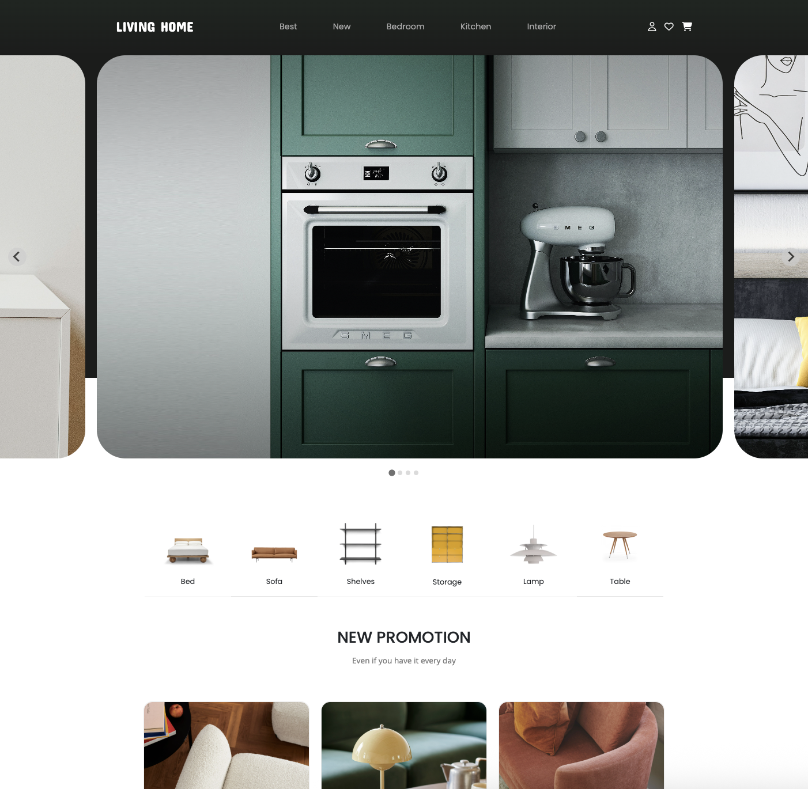

### ﹅ Livinghome (E-commerce Furniture Shop) 🛒

This personal project was developed using HTML, CSS, and JavaScript. Product data is stored in a data.json file and displayed dynamically on the page. The website includes functionality to filter products by furniture category and sort items by price or name using JavaScript.

<br>

### ﹅ Tech Stack

- **Frontend**: HTML, CSS, JavaScript, TypeScript, Bootstrap
- **Graphic design**: Photoshop

<br>

### ﹅ Preview



<br>

### ﹅ Features

- 🖼️ Main banner carousel with sliding animation
- 🛋️ Filtering by furniture type (e.g., sofa, table, etc.)
- 🔃 Sorting by price and name
- 📱 Responsive design for various devices

<br>

### ﹅ Installation

```bash
git clone https://github.com/dyoungky/Livinghome.git
npm install
npm start
```
